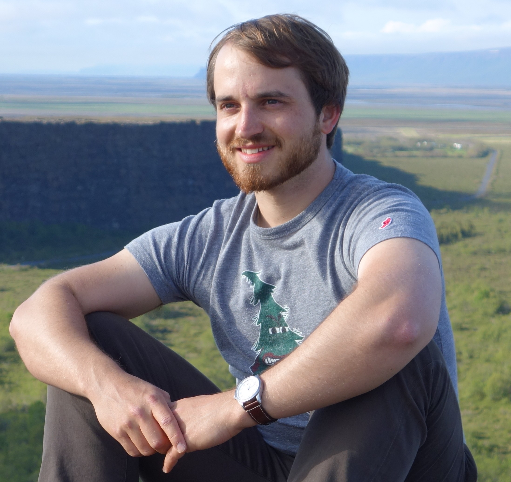

---
---

<link rel="stylesheet" href="styles.css" type="text/css">

# Summary
I am a computational statistician, with a background in causal inference and machine learning. 
I pride myself on writing unit-tested and well-documented code that yields reproducible results in a performant manner. 
Currently, I practice Data Science at [Airbnb](https://medium.com/airbnb-engineering/tagged/data-science) and also Lecture a sequence of graduate level scientific-computing courses at Stanford University.

My full CV is available [here](files/santucci_andreas.pdf).

## Personal Life
I have been overjoyed these past couple years by my rescue dog, Bean!

In my youth, I practiced Gymnastics. Here's [a video of me competing at a national competition in Las Vegas](https://www.youtube.com/watch?v=8Qg4V50X7QQ&t=17s); incidentally, I was part of Stanford's team at the time.

In college, I walked-on to Cal's Swimming and Diving team. Here's [one of my dives from my last home-meet in 2012](](https://www.youtube.com/watch?v=8Qg4V50X7QQ&t=17s)). Training 30+ hours a week got me wondering: what's the effect on my academic performance? With this, I set out to write my senior thesis exploring [causal effects of NCAA D1 sports participation on GPA's](http://econ.berkeley.edu/sites/default/files/Santucci.pdf). Obtaining an answer to a question that mattered to me, I got hooked on statistics.